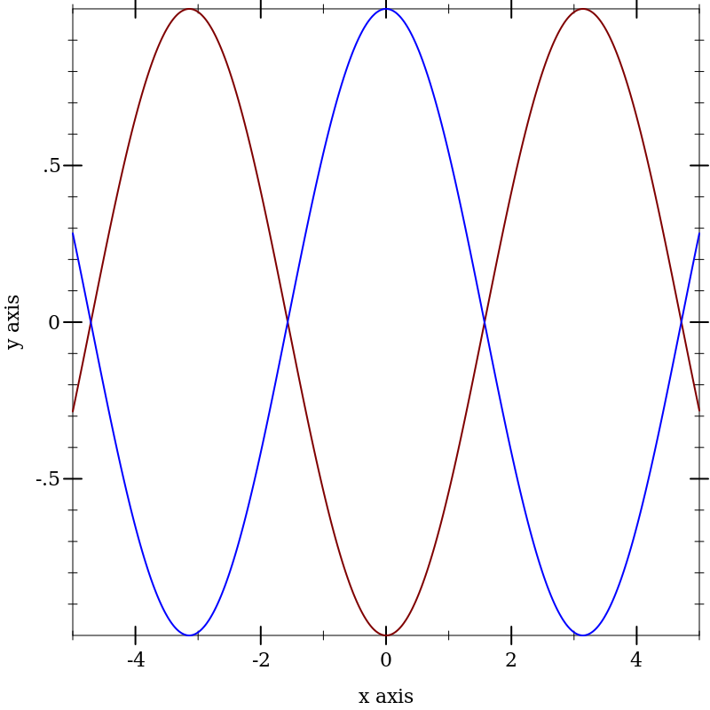
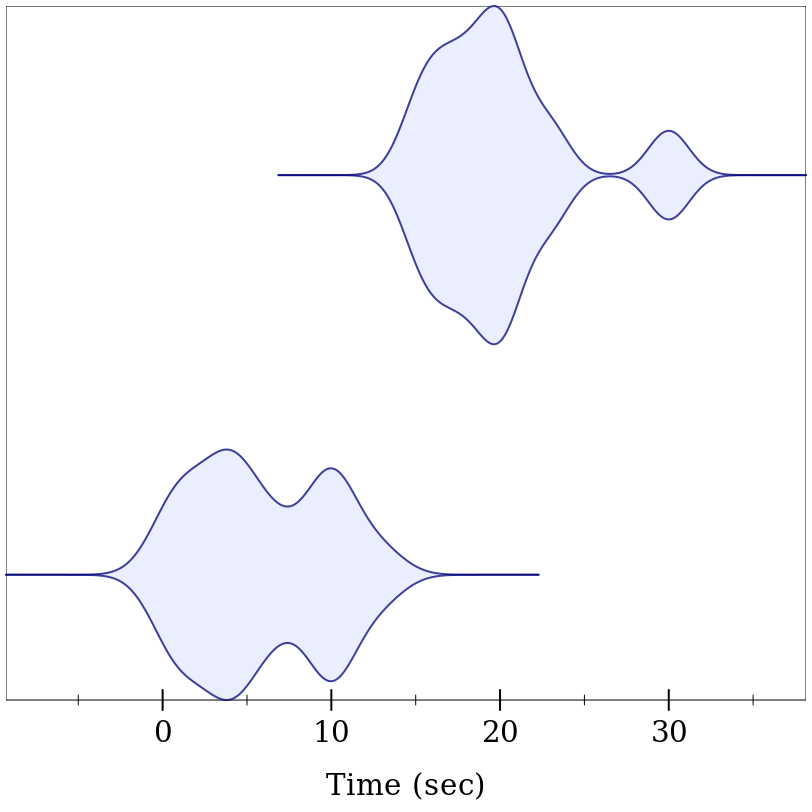
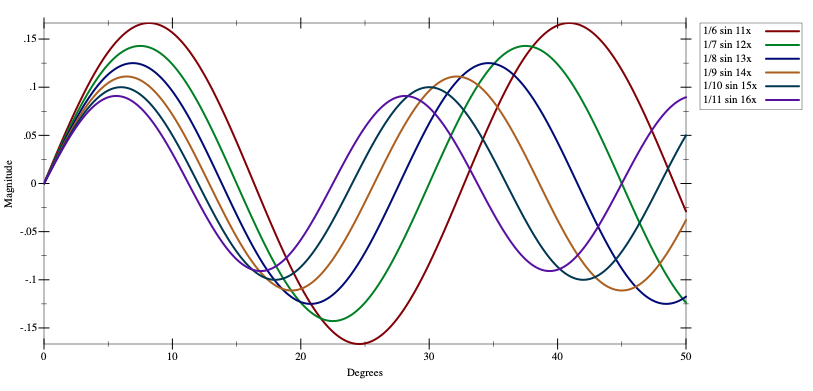
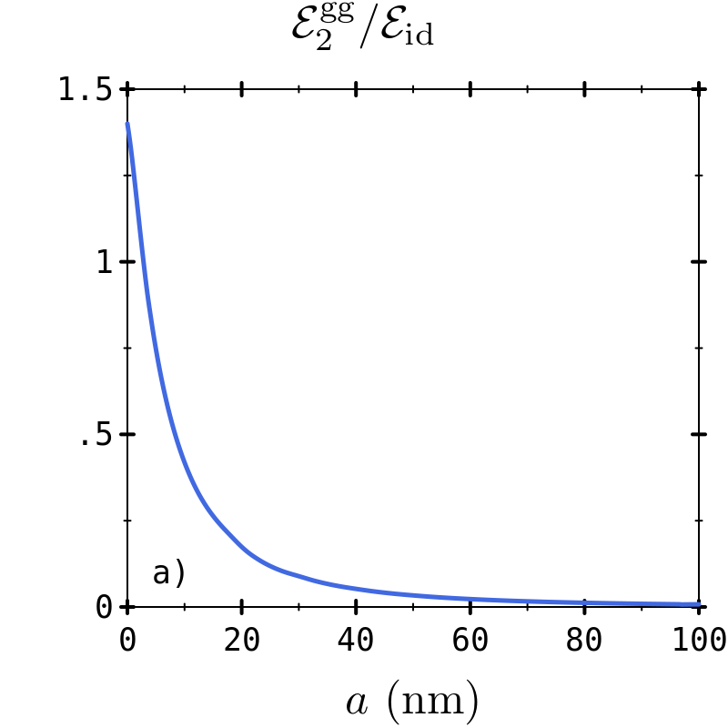
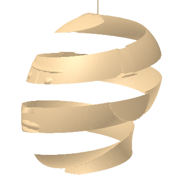
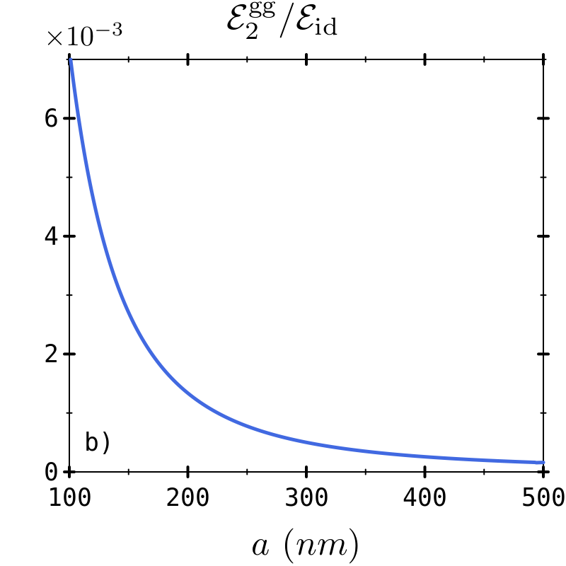

# Plot-cookbook

Welcome to the Racket Plot Cookbook. This is a growing collection of recipes for creating the tastiest plots with the [Racket Plot library](https://docs.racket-lang.org/plot/index.html) (documentation).

If you would like to contribute please create an issue or pull request with your contribution. Please include image, code, and short description.

Contributions are accepted on the condition they are licenced under the same terms as Racket: MIT or Apache 2.

## Plots

<table  align="center">
  <tr>
    <td align="center"><a href="examples/cosandderiv/README.md"> <b>Draw a graph of cos and deriv^3(cos)</b></a> </td>
    <td align="center"><a href="examples/violin/README.md"> <b>Violin plot</b></a> </td>
    <td align="center"><a href="examples/sines/README.md"> <b>Sines</b></a> </td>
  </tr>
  <tr>
    <td align="center"><a href="examples/Iso/README.md"> <b>Iso</b></a> </td>
    <td align="center"><a href="examples/Iso/README.md"> <b>Logo plot</b></a> </td>
    <td align="center"><a href="examples/f1/README.md"> <b>f1 plot</b></a> </td>
  <tr>
  <tr>
    <td align="center"><a href="examples/face/README.md"> <b>Face</b></a> </td>
    <td align="center"><a href="examples/f2/README.md"> <b>F2</b></a> </td>
    <td align="center"><a href="examples/face/README.md"> <b>Face</b></a> </td>

  <tr>
</table>

