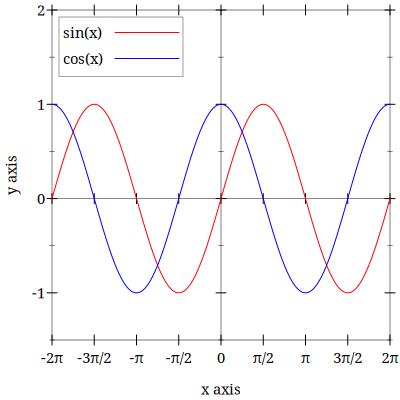

# Radian-ticks



```scheme
#lang racket
(require plot)

(define step (/ pi 2))
(define pi-ticks
  (ticks
   (λ (min max)
     (for/list ([x (in-sequences
                    (in-value 0)
                    (in-inclusive-range step max step)
                    (in-inclusive-range (- step) min (- step)))])
       (pre-tick x #t)))

   (λ (min max _)
     (define (pi/2-label i sign)
       (define numerator (quotient i 2))
       (define no-denom? (= i (* numerator 2)))
       (define prefix (if sign "-" ""))
       (if no-denom?
           (format "~a~aπ" prefix (if (= 1 numerator) "" numerator))
           (format "~a~aπ/2" prefix (if (= 1 i) "" i))))
     (define (range->labels start end step sign)
       (for/list ([_x (in-inclusive-range start end step)]
                  [i (in-naturals 1)])
         (pi/2-label i sign)))
     (cons "0" (append (range->labels step max step #f)
                       (range->labels (- step) min (- step) #t))))))

(define to (* 2 pi))
(define from (- to))
(parameterize ([plot-x-ticks pi-ticks])
  (plot
   (list
    (axes)
    (function sin from to #:label "sin(x)" #:color 'red)
    (function cos from to #:label "cos(x)" #:color 'blue))
   #:y-min -1.5 #:y-max 2))
```

Thanks to [Levon](https://github.com/racket-raccoon) aka Bedivere on Racket Discord [](https://discord.gg/6Zq8sH5)
