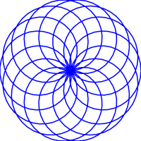

# Rose



```scheme
#lang racket
(require plot)

;; plot settings
(line-width 1.5)
(plot-width 200)
(plot-height 200)
(plot-font-size 10)
(plot-x-far-axis? #f)
(plot-y-far-axis? #f)
(plot-x-axis? #f)
(plot-y-axis? #f)
(plot-x-label #f)
(plot-y-label #f)
(plot-pen-color-map 'tab10)

(define (rose theta k a)
  (* a (cos (* k theta))))

(plot (polar (lambda (theta) (rose theta (/ 7 8) 1)) 0 (* 16 pi) #:samples 500 #:color "blue")
      #:out-file "rose.svg")
```
